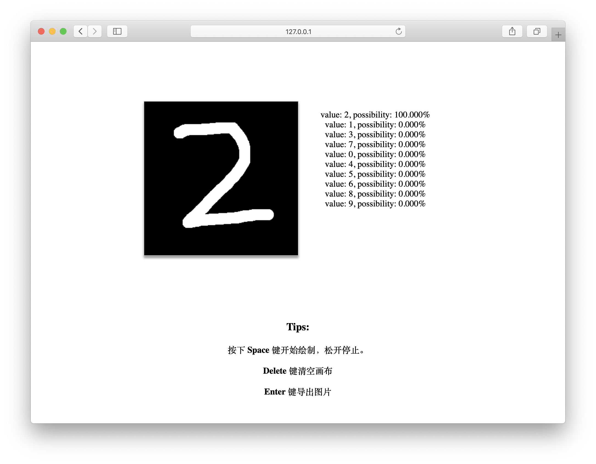

### 本科毕业设计
数字手写体识别

#### 项目运行流程
- clone 项目到本地`git clone https://github.com/qmdx00/graduation-design.git`
- 本地安装`docker`和`docker-compose`
- 进入项目根目录，运行`build.sh`脚本
- 浏览器打开 http://127.0.0.1:5000 访问项目

#### 运行结果
